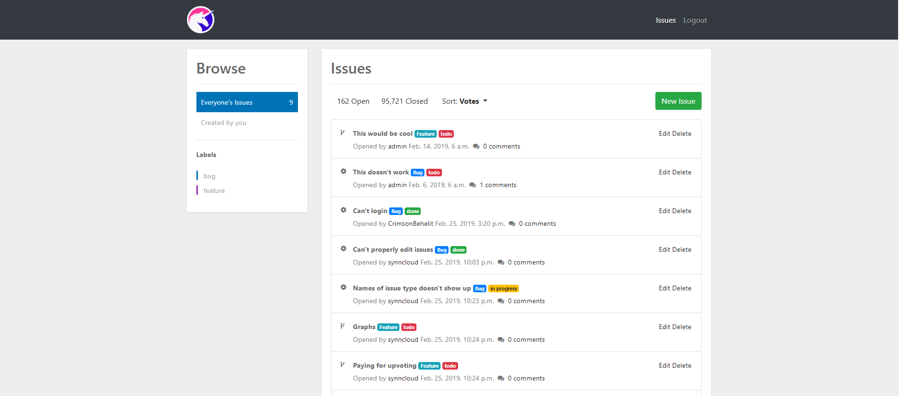

#UnicornAttractor Issue Tracker

## About

The goal of this application is to provide a ticket based website that provides bug support for users of the Unicorn Attractor fictional application, while also asking payment for feature requests. These requests can be upvoted by users for a small contribution.
In return for these costs, we promise to always spend 50% of our time developing the highest-paid features.
Besides that, the application should be as user-friendly, clean and maintainable as possible.
It is still a work in progress.

## Technologies Used

**[Django](https://www.djangoproject.com/)**

**[Bootstrap](http://getbootstrap.com/)**

**[jQuery](https://jquery.com/)**

**[Font Awesome](http://fontawesome.com/)**

**[MySQL](http://www.mysql.com/)**

## Current features

### Authentication (Registration and Login)

### CRUD issues (Bugs and features)

### Responsive, user friendly UI

## To Do

### Payments for features/votes

### Graphs

### Extensive filtering for issues

### User comments

### Testing

### Authentication polish

## Hosting

